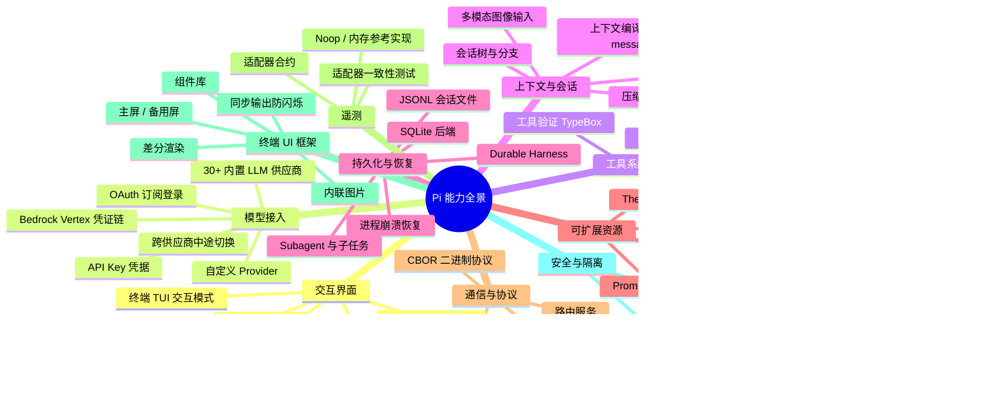

# Pi 功能全景图

> Pi 是一个最小化、可扩展的 Coding Agent 框架。它把模型请求、工具执行、上下文组装、会话持久化统一在一套 agent loop 里，并允许通过 extensions / skills / prompt templates / themes / packages 定制 Pi 的行为。

本文档从「功能」视角俯瞰整个 monorepo —— 它不关注代码组织，而是回答：**Pi 让用户、扩展者、嵌入者各能做什么**。

**交互式架构图**：[feature-landscape.html](feature-landscape.html) — 三个使用者角色、十大能力域及背后 npm 包的连线视图。

---

## 1. 一图概览：能力域全景



---

## 2. 给「使用者」的功能矩阵

下面是从用户视角看 Pi 提供什么。

| 功能 | 描述 | 入口 | 支持包 |
| --- | --- | --- | --- |
| 交互模式 | 终端 TUI 中对话：发送消息、查看工具调用、扩展编辑器、跟随/中断工作流 | `pi` | `@earendil-works/pi-coding-agent` |
| 打印模式 | 一次性输入 prompt、写出最终答复 | `pi -p` / `pi --print` | `@earendil-works/pi-coding-agent` |
| JSON 事件流模式 | 把 agent 事件以 JSONL 输出，便于脚本消费 | `pi --mode json` | `@earendil-works/pi-coding-agent` |
| RPC 模式 | stdin/stdout 上跑 JSONL 协议，跨进程拉起 Pi | `pi --rpc` | `@earendil-works/pi-coding-agent` |
| SDK 进程内嵌入 | 在应用内创建并控制 Agent 会话 | `import { createAgentSession }` | `@earendil-works/pi-coding-agent` |
| 多模型选择 | `/model` 命令切换；支持 30+ 内置 provider | `/model` | `@earendil-works/pi-ai` |
| 思考强度切换 | `/thinking` 或 `Shift+Tab` 切换 reasoning 等级 | `/thinking` | `@earendil-works/pi-agent-core` |
| 登录 / 登出 | 用订阅或 API key 接入 OAuth/Key | `/login` | `@earendil-works/pi-ai` |
| 文件 / 图片附件 | `@` 引用文件 / 拖入图像 | 编辑器 `@` | `@earendil-works/pi-agent-core` |
| 命令直执行 | `!` 前缀命令把输出发给模型；`!!` 不发 | `!git status` | `@earendil-works/pi-coding-agent` |
| 会话恢复 | 关闭 Pi 后再开：`/resume` 或 `pi --continue` | `/resume` | `@earendil-works/pi-coding-agent` |
| 会话分支 | `/tree`、`/fork`、`/clone` 探索不同方案 | `/fork` | `@earendil-works/pi-coding-agent` |
| 压缩 | `/compact` 缩短上下文，保留原文 | `/compact` | `@earendil-works/pi-coding-agent` |
| 主题 | 自定义终端配色 | `/themes` | `@earendil-works/pi-tui` |
| 提示模板 | `/` 触发命名 prompt templates | `/commit` | `@earendil-works/pi-coding-agent` |
| Skill | 按需加载的领域知识模块 | `/skill` | `@earendil-works/pi-coding-agent` |
| 快捷键 | 自定义键位 | `/hotkeys` | `@earendil-works/pi-coding-agent` |
| 会话导出 | `/export` 输出 HTML / JSONL | `/export` | `@earendil-works/pi-coding-agent` |
| 会话分享 | `/share` 上传到 Radius 关联凭证 | `/share` | `@earendil-works/pi-coding-agent` |

---

## 3. 给「扩展者」的能力矩阵

这是给想要「让 Pi 做新事」的人。

| 扩展点 | 描述 | 声明位置 | 生命周期 |
| --- | --- | --- | --- |
| **Extension（TypeScript 模块）** | 注册工具、命令、键位、provider、事件处理器、UI | 生命周期 |
| **Skills（按需加载）** | 模型用描述发现，按需注入完整指令与文件 | 启动时枚举、按需 |
| **Prompt Templates** | 编辑器输入前可展开的命名消息 | `/` 触发 |
| **Themes** | 终端颜色、字体样式 | `/themes` 切换 |
| **自定义 Provider** | `createProvider()` 接入 Ollama/vLLM/LM Studio 等 OpenAI 兼容服务 | 启动时实例化 |
| **自定义工具** | TypeBox schema + `execute()`，可流式输出 | 通过 extension 注册 |
| **MCP Server 工具** | 通过 `@earendil-works/pi-mcp` 接入任何 MCP 服务 | 启动时连接 |
| **Codemode 脚本** | 模型写 JS 调用已注入工具，结果合并输出 | 单次执行 |
| **Tool 钩子** | `beforeToolCall` 拦截或阻断；`afterToolCall` 改写结果 | 每次工具调用 |
| **Turn 钩子** | `prepareRequest` 注入上下文；`finishTurn` 控制是否继续 | 每次 LLM turn |
| **Provider Hooks** | `transformHeaders`、`onPayload`、`onProviderStreamEvent` | 每次 HTTP |
| **Renderer Hooks** | 自定义 `agentComponent` 渲染器 / 编辑器 UI 装饰 | 期间订阅 |

---

## 4. 给「嵌入者」的能力矩阵

这是给想「把 Pi 当作组件装进自己的应用」的人。

| 集成方式 | 适用场景 | 包 |
| --- | --- | --- |
| **TypeScript SDK** | 单进程内集成 Agent，订阅事件、直接构造 session | `@earendil-works/pi-coding-agent` |
| **Pi Agent Core** | 需要更细粒度的 agent 控制（tool/transform/queue） | `@earendil-works/pi-agent-core` |
| **Pi AI 仅模型** | 不需要 Agent，只要统一的 LLM API | `node_modules/@earendil-works/pi-ai` |
| **Durable Harness** | 需要崩溃恢复、多任务、subagent、watch UI 的长时服务 | `node_modules/@earendil-works/pi-durable` + `@earendil-works/chord` |
| **Chord 远程绑定** | 多 facet、跨进程服务、复制状态 | `node_modules/@earendil-works/chord` |
| **CBOR Protocol Server** | 用 Unix socket 把会话暴露给远程客户端 | `@earendil-works/pi-server` + `@earendil-works/pi-protocol` |
| **MCP 客户端** | 需要连入其他 MCP 客户端应用 | `@earendil-works/pi-mcp` |
| **Codemode 单库** | 需要 QuickJS 沙箱调用任何已注入函数 | `@earendil-works/pi-codemode` |
| **TUI 框架** | 需要差异渲染、可复用输入框做自己的 TUI | `@earendil-works/pi-tui` |
| **Telemetry 适配器** | 需要在 Pi 包里加可观测性 hook | `@earendil-works/pi-telemetry` |

---

## 5. 关键能力维度详解

### 5.1 模型供应商能力

| 能力 | 说明 |
| --- | --- |
| 内置 provider 数量 | 30+（OpenAI、Anthropic、Google、Vertex、OpenRouter、Bedrock、Mistral、Groq、Cerebras、xAI、Together、Baseten、HuggingFace、Moonshot、Kimi、Qwen、Xiaomi、MiniMax、ZAI、Github Copilot、Fireworks、Azure OpenAI、Ant Ling、NVIDIA NIM、DeepSeek、Radius、TypeSafe、Cloudflare 等） |
| 任意 OpenAI 兼容端点 | Ollama、vLLM、LM Studio 等可通过 `createProvider()` 接入 |
| 内置图像生成 | 通过 OpenRouter 的 `generateImages()` |
| 内置分类器 | TypeSafe Jev / OpenRouter / Vercel / Cloudflare / OpenCode / llama.cpp |
| OAuth 登录 | Anthropic（Claude Pro/Max）、OpenAI（ChatGPT Plus/Pro）、GitHub Copilot、OpenRouter |
| Vertex AI 认证 | API Key / Application Default Credentials / service-account |
| Bedrock 认证 | AWS profile / access key / bearer token / web identity |
| 跨供应商切换 | 同一会话可中途切到另一 provider，thinking 自动以 `<thinking>` 文本转译 |
| 强制 cache retention | `cacheRetention: "short" | "long" | "none"` |

### 5.2 工具能力

| 能力 | 说明 |
| --- | --- |
| 内置 CodingTools | `read`、`write`、`edit`、`bash`（来自 `@earendil-works/pi-durable/tools` 的 `CodingTools` 扩展） |
| TypeBox schema | 用 `Type.Object(...)` 描述参数，provider 自动校验 |
| Constrained sampling | `strict: 'prefer' | 'require'` 触发 provider 端严格 JSON 模式 |
| OpenAI Grammar tool | `constrainedSampling.type: 'grammar'` 用 Lark/regex 在 GPT-5+ 上约束 |
| 流式 tool call | `toolcall_delta` 携带部分参数，前端可渐进渲染 |
| 工具并行 / 串行 | 全局 `toolExecution: 'parallel' | 'sequential'`，单个工具可覆盖 |
| 工具拦截 | `beforeToolCall` 可 block，`afterToolCall` 可改写结果 |
| `terminate: true` | 整批工具结果都标记终止时跳过下一轮 LLM |
| Codemode | 模型写 JS 调用所有注入的工具；嵌套调用不进 LLM 上下文 |
| MCP | stdio / Streamable HTTP transport，支持 OAuth、batch 通知 |

### 5.3 上下文与会话能力

| 能力 | 说明 |
| --- | --- |
| 会话树 | 每个 entry 有 `parentId`，可分支、可重放 |
| JSONL 持久化 | `Session` 文件以 JSONL 存储 |
| System Messages (`pi.system`) | 可在 prompt 中途加指令、加减工具、变更 section，且只发增量 |
| 多模态 | `image` 块可作为 user / toolResult 输入 |
| 跨模型 thinking 桥接 | 不同供应商间互转时 thinking 自动降级为 `<thinking>` 文本 |
| Steering | 当前助手 turn 完成后注入 |
| Follow-up | 当前 run 完全结束才进入 |
| 中止 | `agent.abort()` 停止当前 run，queued 消息回到编辑器 |

### 5.4 可扩展性能力

| 能力 | 说明 |
| --- | --- |
| 进程内 Extension | TypeScript 模块，注入到 Pi 进程；可注册工具、命令、键位、provider、事件处理器、UI |
| Skill | 描述里写摘要，模型按需触发，运行时按 description 匹配 |
| Prompt Template | `/` 触发，自动展开成编辑器内容 |
| 主题 | terminal colors + OKLCH 色彩 |
| Pi Packages | 通过 npm / git 分发上述所有扩展资源 |

### 5.5 嵌入式运行时能力

| 能力 | 包 |
| --- | --- |
| Stateful Agent + Event 流 | `@earendil-works/pi-agent-core` |
| Durable Conversation + Crash Recovery | `@earendil-works/pi-durable` |
| Chord 跨进程 facet + repliable state | `@earendil-works/chord` |
| CBOR 协议路由与版本握手 | `@earendil-works/pi-protocol` |
| Unix Socket Server + Session attachment | `@earendil-works/pi-server` |
| MCP 客户端 | `@earendil-works/pi-mcp` |
| QuickJS 沙箱 codemode | `@earendil-works/pi-codemode` |
| TUI 框架（差分渲染 / 同步输出） | `@earendil-works/pi-tui` |
| 遥测合约（OpenTelemetry 适配器接口） | `@earendil-works/pi-telemetry` |

### 5.6 安全与隔离能力

| 能力 | 说明 |
| --- | --- |
| 项目信任 | 进入项目时询问是否信任项目资源 |
| 容器化方案 | Docker、Gondolin（Linux 微 VM）、OpenShell |
| 工具权限 | Pi 不内置权限系统，工具调用继承 Pi 进程权限 |
| 扩展运行 | Extension 与 Pi 进程同实例 — 默认继承 OS 权限 |
| 沙箱 | 内置 `!` 命令和工具可被 Gondolin 路由到本地 Linux 微 VM |
| 凭据隔离 | `pi` 与 provider auth 留在 host，工具被沙箱化 |

### 5.7 终端 UI 能力

| 能力 | 说明 |
| --- | --- |
| 差分渲染 | 只画变更行 / viewport rows |
| 同步输出 | CSI 2026 包裹，避免闪烁 |
| 主屏 / 备用屏 | `TuiMainScreen`（保留 scrollback）/ `TuiAltScreen`（应用自有滚动） |
| 鼠标 / 触摸板 | SGR mouse 规范化，hit-test、拖拽、wheel 滚动 |
| 键位检测 | `matchesKey()` + `Key.*` 常量，支持 Kitty keyboard protocol |
| 括号粘贴 | 自动标记 >10 行粘贴 |
| 内嵌图像 | Kitty / iTerm2 协议 |
| 滚动视图 | `ScrollView`、OSC 133 提示符跳转、内置搜索 |
| 组件库 | Text、Editor、Input、Markdown、Loader、SelectList、SettingsList、MouseRegion、Image、Box、VStack、HStack、ScrollView |

---

## 6. 入口与典型工作流

### 6.1 终端交互

```text
pi                       # 启动 TUI，从上次会话恢复
pi --new                  # 强制新会话
pi --continue            # 从最新会话恢复
pi -p "fix the build"    # 打印模式
pi --mode json -p "..."  # JSON 事件流
pi --rpc                 # JSONL RPC 模式
pi update                # 更新 Pi（与本期版本配套）
```

### 6.2 进程内 SDK

```ts
import { createAgentSession } from "@earendil-works/pi-coding-agent";
const session = await createAgentSession({ ... });
session.subscribe((event) => render(event));
await session.prompt("Refactor utils.ts");
```

### 6.3 Durable Harness

```ts
import { Harness, MemoryStorage, createRegistry, CodingTools } from "@earendil-works/pi-durable";
const harness = await Harness.open(new MemoryStorage(), { models, registry: createRegistry() }, ctx);
const root = await harness.root(ctx, { agent: { model: { provider: "openai", modelId: "gpt-6-sol" } } });
const submission = await root.submit({ type: "input", content: "..." }, ctx);
await submission.wait();
```

---

## 7. 资源分发方式

| 资源类型 | 分发方式 | 加载时机 |
| --- | --- | --- |
| Extension | npm 包 + `piConfig.extensions` | Pi 启动 |
| Skill | 文件夹 `SKILL.md` 或 npm 包 | Pi 启动枚举、按需加载 |
| Prompt Template | 文件 `prompts/*.md` 或 npm 包 | Pi 启动 |
| Theme | 文件 `themes/*.json` 或 npm 包 | `/themes` 选择 |
| Pi Package | npm 上 `@earendil-works/pi-*` 包 | Pi 通过 `pi-mono` 加载 |

---

## 8. 与生态的关系

| 角色 | 关系 |
| --- | --- |
| [earendil-works/pi-chat](https://github.com/earendil-works/pi-chat) | Slack/聊天自动化的工作流；与本仓库的 Pi 共用 `@earendil-works/pi-*` 包 |
| OpenClaw | 真实集成示例项目；展示 SDK 集成 |
| providers / 模型目录 | 由 `pi.dev/model-catalog` 提供；`generate-models` 拉取生成 |

---

## 9. 不在 Pi 内核的功能

Pi 明确**不**实现这些，使用者按需安装：

- 子-多 agent
- 计划模式 (plan mode)
- 内置权限系统
- 跨进程锁定 / 文件锁
- 浏览器自动化
- 网页抓取

Pi 的设计哲学：「开箱够用，缺的让用户安装 Pi package 来补」。

---

## 10. 总结

Pi 的功能全景可以归到 **3 个角色 × 4 层能力** 的网格：

| 角色 \ 层级 | 模型与工具 | 上下文与会话 | 持久化与可观测 | 协议与传输 |
| --- | --- | --- | --- | --- |
| **使用者** | 多 provider、思考强度、内置工具 | 会话树、压缩、steering/follow-up | JSONL 会话、导出、分享 | TUI、Print、JSON、RPC |
| **扩展者** | 自定义 provider、MCP 工具、codemode | skills、prompt templates、themes | extensions 钩子链 | — |
| **嵌入者** | `@earendil-works/pi-ai` 直接调 LLM | `@earendil-works/pi-agent-core` 控制 Agent | `@earendil-works/pi-durable` 持久化 Harness | `@earendil-works/pi-server` + `@earendil-works/pi-protocol` |

这张网格就是 Pi monorepo 的能力地图。下一节 [模块架构图](module-architecture.md) 揭示这些能力被拆成哪些 npm 包，包之间的依赖图与运行时组件图。