# Pi 模块架构图

> 本文档描绘 Pi monorepo 的**包依赖关系**、**分层架构**与**运行时组件拓扑**，并说明每个模块的职责边界。

仓库 `packages/` 目录下的 15 个包在功能上分属 5 层：基础设施、模型与协议、Agent 运行时、嵌入式运行时、终端 UI 与 CLI。每一层有明确的依赖方向 — **永远只依赖更低层，不反向依赖**。

**交互式架构图**：[module-architecture.html](module-architecture.html) — 12 个 npm 包按 5 层组织的依赖连线视图。

---

## 1. 包清单速览

| 包名 | 路径 | 角色 |
| --- | --- | --- |
| `@earendil-works/chord` | `packages/chord` | 应用组合运行时（facets、services、replicated state） |
| `@earendil-works/pi-protocol` | `packages/protocol` | CBOR 二进制协议与帧 |
| `@earendil-works/pi-telemetry` | `packages/telemetry` | 供应商中立遥测合约 |
| `@earendil-works/pi-ai` | `packages/ai` | 多供应商 LLM 统一 API |
| `@earendil-works/pi-codemode` | `packages/codemode` | QuickJS 沙箱内运行模型代码 |
| `@earendil-works/pi-mcp` | `packages/mcp` | MCP 客户端（stdio / Streamable HTTP） |
| `@earendil-works/pi-agent-core` | `packages/agent` | 状态化 Agent + 工具执行 + 事件流 |
| `@earendil-works/pi-durable` | `packages/durable` | Durable conversation / task / document runtime |
| `@earendil-works/pi-tui` | `packages/tui` | 终端 UI 框架（差分渲染） |
| `@earendil-works/pi-coding-agent` | `packages/coding-agent` | Pi CLI（终端 + RPC + 工具集 + 扩展） |
| `@earendil-works/pi-server` | `packages/server` | 本地 CBOR 服务（路由 Sessions） |
| `@earendil-works/pi-client` | `packages/client` | 远端 Pi 会话的传输中性客户端 |
| `@earendil-works/pi-evals` | `packages/evals` | 评测工具（私有） |

---

## 2. 包依赖图

### 2.1 总览（分层）

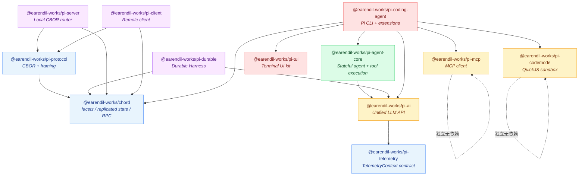

> 关键约束：**chord / protocol / telemetry / codemode / mcp / tui 不依赖任何其他 pi 包**。它们是基础设施层，可被任何上层单独消费。

### 2.2 Workspace 内的精确依赖

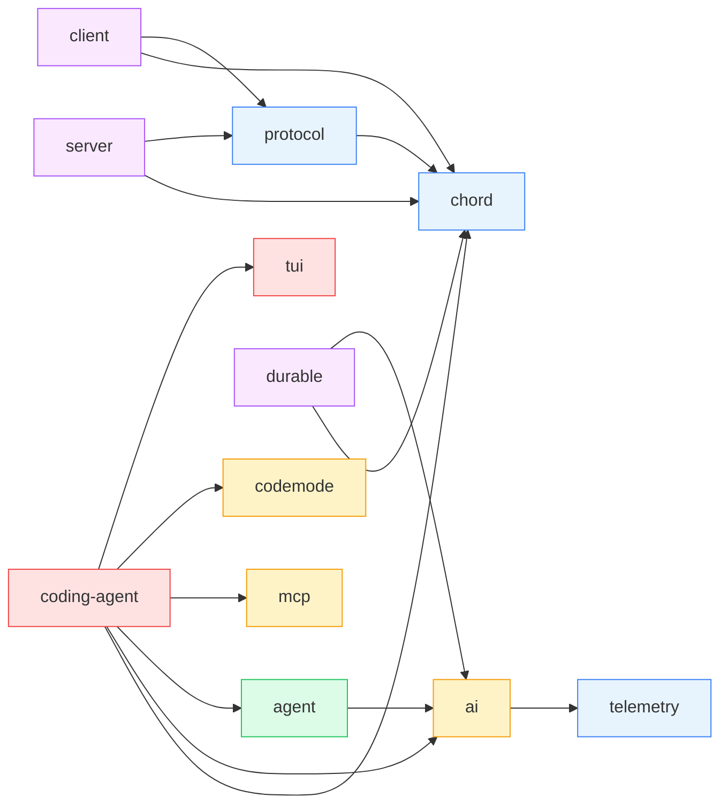

> 没有任何包依赖 `coding-agent`（它是产品层），没有任何包跨层依赖「同层」包。

---

## 3. 分层架构（从底层到顶层）

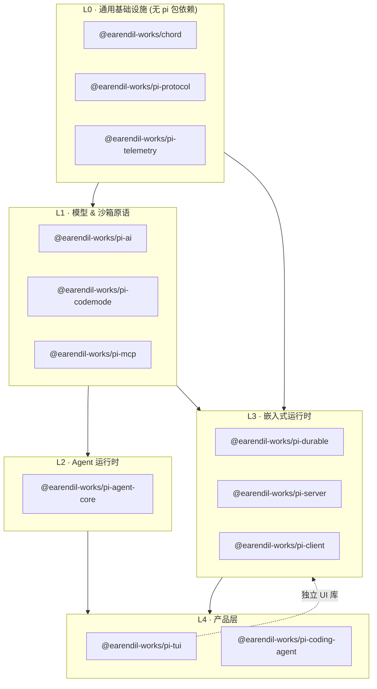

| 层 | 职责 | 反向依赖约束 |
| --- | --- | --- |
| **L0 基础设施** | 通用原语 | 不依赖任何 pi 包 |
| **L1 模型 & 沙箱** | 把 LLM 与外部世界封装成统一接口 | 不依赖 L2+ |
| **L2 Agent 运行时** | 单进程 Agent 调度 | 不依赖 L3+ |
| **L3 嵌入式运行时** | 跨进程、跨主机的运行时 | 允许依赖 L0、L1 |
| **L4 产品层** | TUI、CLI、扩展 | 允许依赖所有层 |

---

## 4. 包内模块与运行时组件

### 4.1 `@earendil-works/chord` — 应用组合运行时

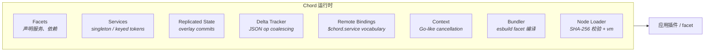

Chord 不是 Pi 包；它是 **Pi 与 Pi 协作应用之间的共享运行时**，可被任何应用使用。

### 4.2 `@earendil-works/pi-ai` — 统一 LLM API

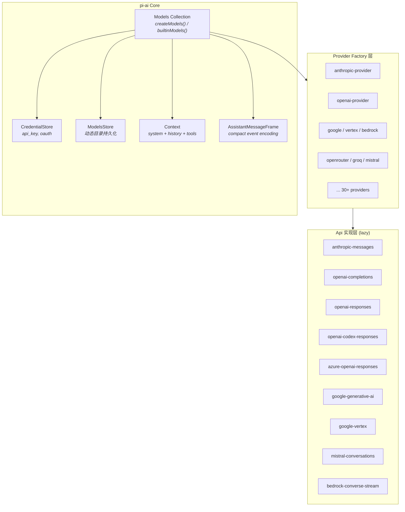

设计原则：**wire protocol 复用**。例如 `openai-completions` 协议被 xAI、Groq、Cerebras、OpenRouter、Together 等多个供应商复用。

### 4.3 `@earendil-works/pi-agent-core` — Agent 运行时

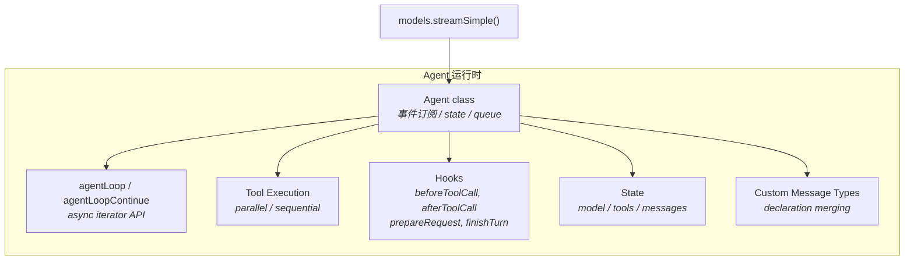

`Agent` 类基于 `transformContext` → `convertToLlm` → LLM 的管道：

```text
AgentMessage[] → transformContext() → AgentMessage[] → convertToLlm() → Message[] → LLM
                    (optional)              (required for custom roles)
```

### 4.4 `@earendil-works/pi-durable` — Durable Harness

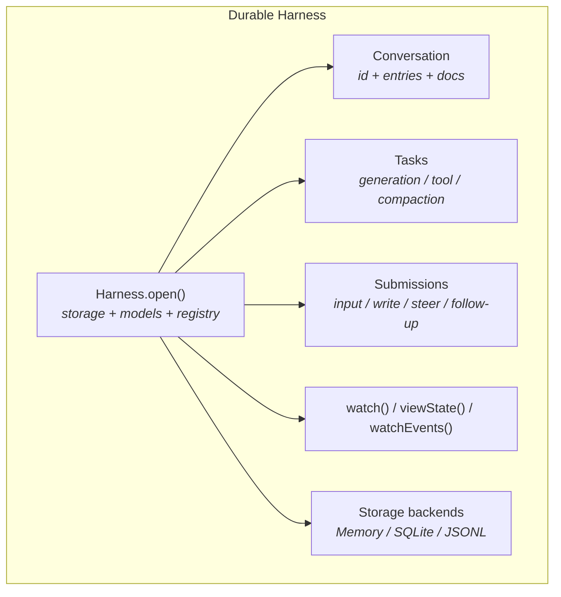

核心循环（one answered input）：

```text
submit(input) → pi.user
  pi.generation → pi.system (only if prompt/tools changed), pi.assistant (tool calls)
    pi.tool × n → pi.tool-result × n   (owned by pi.generation, which waits)
  pi.generation → pi.assistant (answer) → submission done
```

### 4.5 `@earendil-works/pi-coding-agent` — Pi CLI

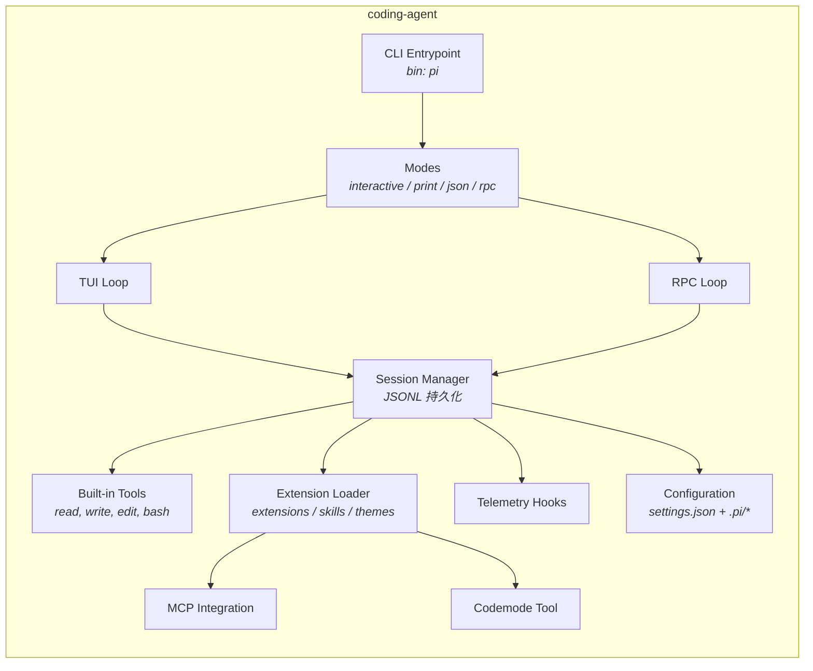

CLI 在 `dist/bundle/` 内使用 esbuild 打包，单文件可执行。

### 4.6 `@earendil-works/pi-server` + `@earendil-works/pi-client` + `@earendil-works/pi-protocol`

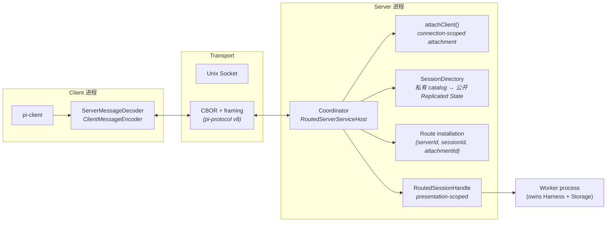

协议使用 4 字节大端 payload length + 然后是一个 definite-length CBOR 项。

### 4.7 `@earendil-works/pi-mcp` — MCP 客户端

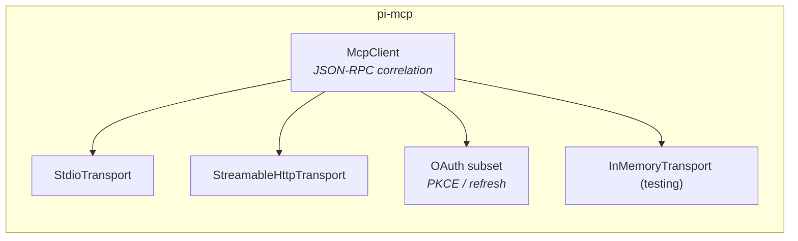

支持的协议面：MCP `2025-11-25`，接受 `2025-06-18` / `2025-03-26` / `2024-11-05`。

### 4.8 `@earendil-works/pi-codemode` — 沙箱

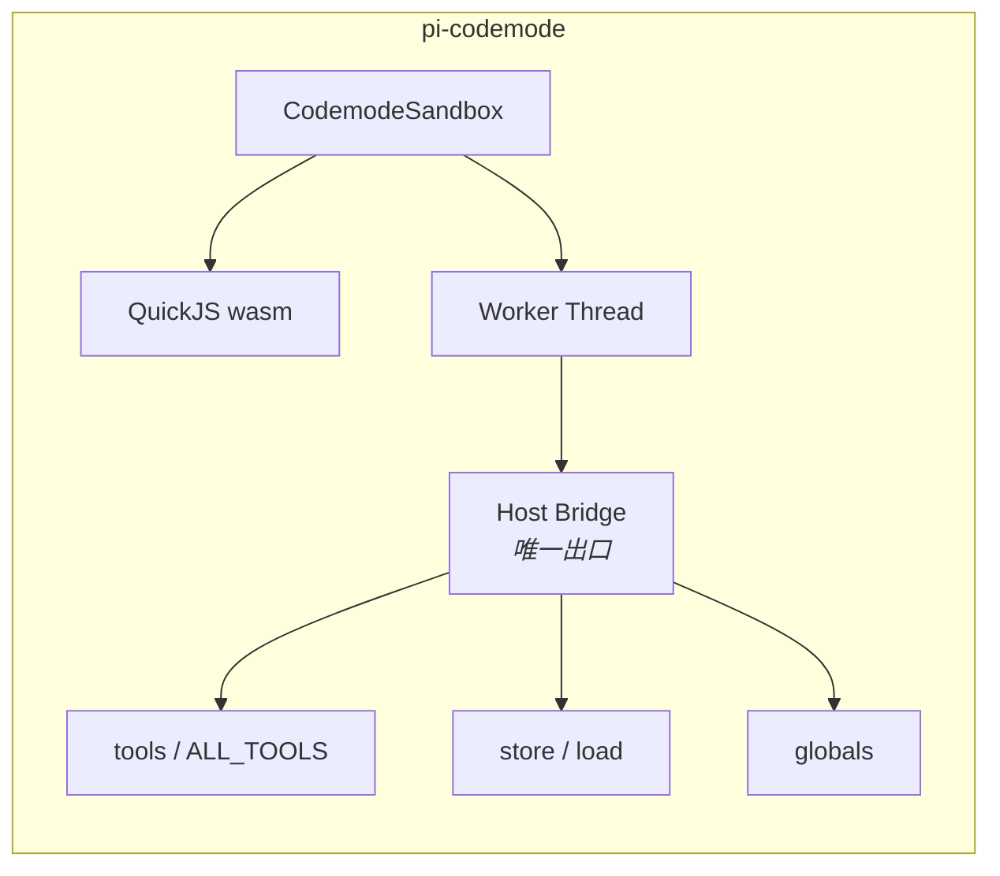

VM 中**唯一可用能力**是调用已注入函数。无 `fetch`、无 `require`、无定时器 — 与宿主完全隔离。

### 4.9 `@earendil-works/pi-tui` — 终端 UI

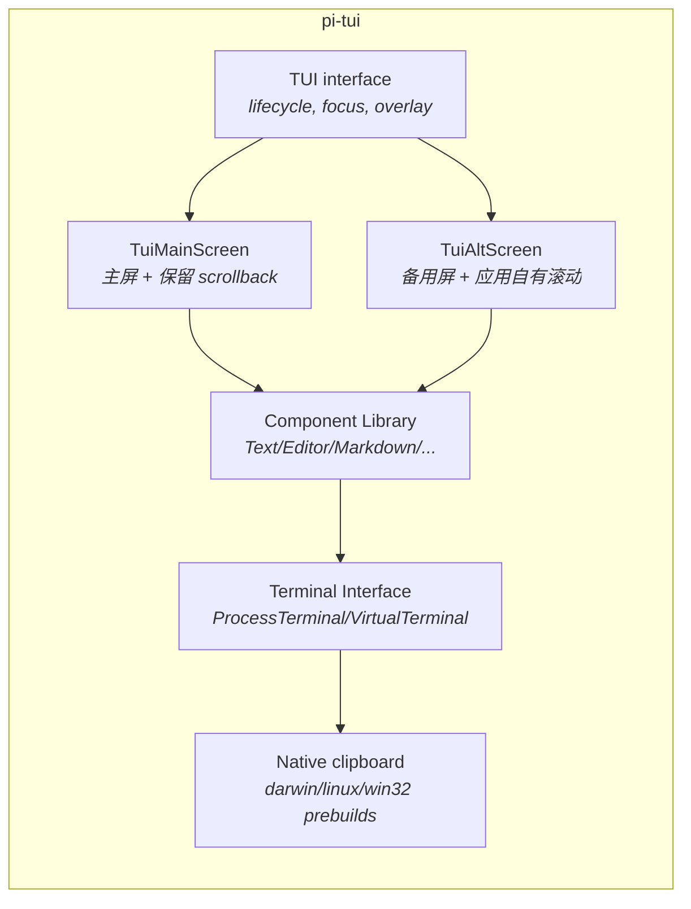

### 4.10 `@earendil-works/pi-telemetry` — 遥测合约

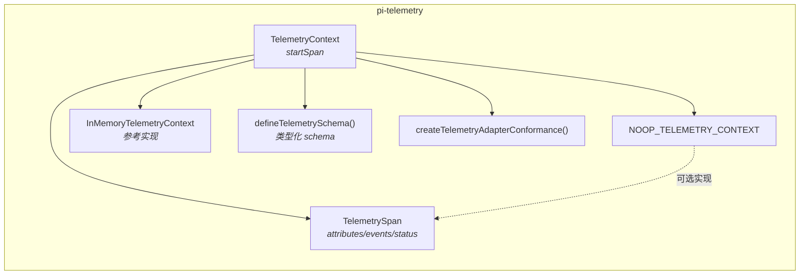

Telemetry 不依赖任何后端，Pi 包定义自己的 schema (`pi.ai.*`、`pi.harness.*`、`pi.session.*`)。

---

## 5. 端到端运行时组件拓扑

下面是从用户启动 `pi` 命令开始、到一次 agent loop 完成的所有运行时组件。

```mermaid
flowchart TB
    subgraph UserSpace["用户终端"]
        Term[("Stdin / TTY")]
    end

    subgraph Process["pi 进程"]
        CLI["CLI (bin: pi)"]
        Mode[Mode Selector<br/><i>interactive / print / json / rpc</i>"]
        Session["Session Manager"]
        ToolsLayer["Tool Registry"]
        Hooks["Hook Chain"]
        Loader["Extension Loader"]
        ThemeLoader["Theme Loader"]
    end

    subgraph CoreEngine["Core Engine"]
        Agent["Agent (pi-agent-core)"]
        Ai["Models Collection (pi-ai)"]
        Conv[("Session JSONL<br/>(on disk)")]
        Emits["Agent Event Stream"]
    end

    subgraph External["外部服务 / Provider"]
        P1["Anthropic / OpenAI / ..."]
        P2["Vertex / Bedrock"]
        P3["OpenRouter / Groq"]
        P5["Local server"]
    end

    subgraph ToolSide["Tool / Sandbox 层"]
        Coding[("Built-in CodingTools")]
        Mcp["MCP Servers"]
        Cmdb["Codemode (QuickJS)"]
    end

    subgraph UiLayer["UI 层"]
        Tui[("TUI 框架<br/>(pi-tui)")]
        DiffRender["Synchronized output / Diff render"]
        Comp[("Component tree")]
    end

    Term --> CLI
    CLI --> Mode
    Mode --> Session
    Session --> Loader
    Loader --> ThemeLoader
    Session --> ToolsLayer
    ToolsLayer --> Coding
    ToolsLayer --> Mcp
    ToolsLayer --> Cmdb
    Session --> Hooks
    Session --> Agent
    Agent --> Ai
    Ai --> P1
    Ai --> P2
    Ai --> P3
    Agent --> Emits
    Session --> Conv
    Emits --> Tui
    Tui --> DiffRender
    DiffRender --> Comp
    Comp --> Term
    Session -.->|RPC mode| P5
    P5 -.->|CBOR| Session
```

---

## 6. Agent Loop 的运行时组件流

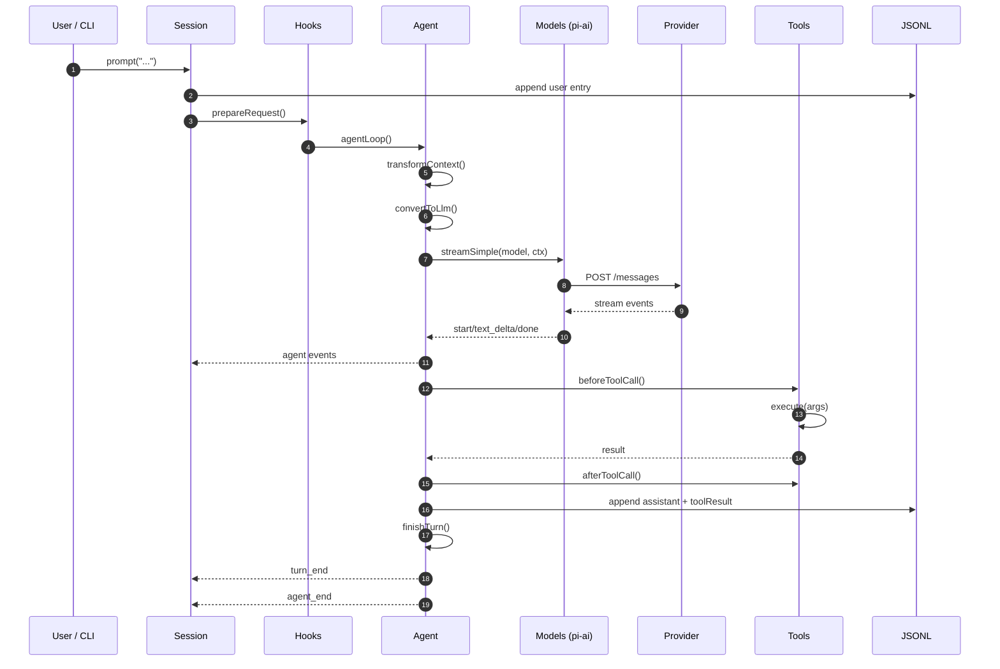

---

## 7. Durable Harness 的写入与重放流

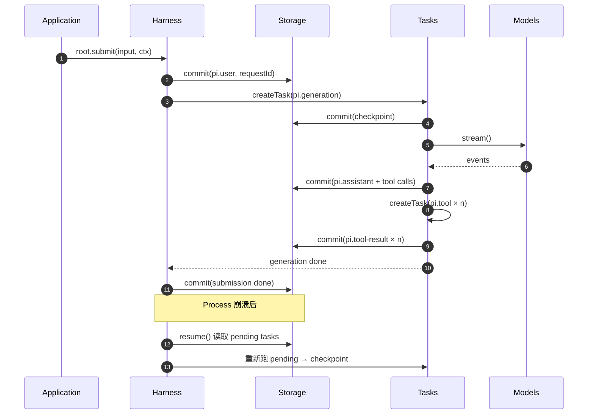

---

## 8. RPC 模式的进程拓扑

```mermaid
flowchart LR
    subgraph Client["Client 进程"]
        UI["Web / CLI / Bot"]
        WM->>UI
        C["pi-client"]
    end

    subgraph Server["Server 进程"]
        Coord["Coordinator<br/>(pi-server)"]
        Sess["SessionDirectory"]
    end

    subgraph Worker["Worker 进程"]
        Harness["Harness"]
        Storage[("SQLite / JSONL")]
        Models["McpServer"]
    end

    Client <-->|CBOR frames| Server
    Server -->|attachClient + route install| Worker
    Worker <--> Storage
    Worker --> Models
```

---

## 9. 关键设计决策

| 决策 | 选择 | 理由 |
| --- | --- | --- |
| 包边界 | 每包一个 npm 包，独立 publish | 允许 SDK / 服务端 / 客户端各自消费；避免庞大单体 |
| chord 独立 | 不属于 `@earendil-works/pi-*`，命名空间隔离 | Chord 是应用组合通用工具，可被非 Pi 项目复用 |
| protocol 用二进制 CBOR | 不用 JSON | 性能、字节级确定性、可携带 |
| telemetry 没 API 过多 | 提供合约 + Noop + 参考实现 + conformance | 不依赖特定 exporter，给应用留选择空间 |
| codemode 强制隔离 | QuickJS + 唯一宿主桥 | 模型代码即便出错也只影响产出，不会逃逸 |
| mcp 不依赖官方 SDK | 重写 core + transport | 体积可控、与官方无关；保留兼容 |
| durable 的 chain 是实验性 | 显式标注 | API 仍在演进 |
| TUI 框架独立 | 选 marketplace 可独立消费 | 其他应用也能复用差分渲染 |
| 进程内 extensions | 不引外部进程 | 简单，避免 RPC 开销；代价是权限同进程 |
| Pin all deps | `.npmrc` + `save-exact=true` | 供应链：直接导入对应部署改动 |
| 无 bundle lockfile | 安装器用 install-lock | 锁定传递依赖；npm 包不锁定 |

---

## 10. 与本系列文档的关联

- **功能全景图** [feature-landscape.md](feature-landscape.md)：解释每个能力由哪个包提供。
- **运行流程图** [runtime-flow.md](runtime-flow.md)：解释这些组件按什么顺序协作完成一次对话。