# Pi 运行流程图

> 本文档描绘 Pi 的核心运行时流程：**用户发送一条消息后，Pi 如何构建上下文、调用模型、流式接收响应、执行工具、持久化结果、决定下一步走向终止**。

涵盖三种主要运行模式：交互模式（TUI）、打印 / JSON 模式、RPC 模式。共有的核心是同一套 **agent loop**，不同的只是外壳。

---

## 1. 全局视角：一次对话的端到端流程

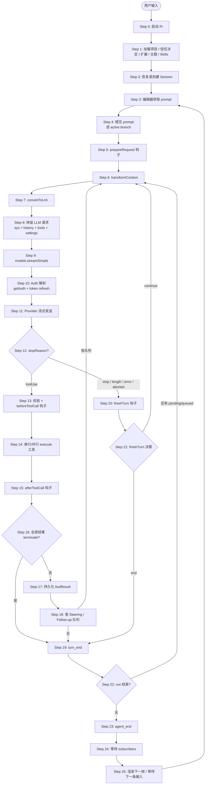

---

## 2. 单 turn 的细节时序（interactive mode）

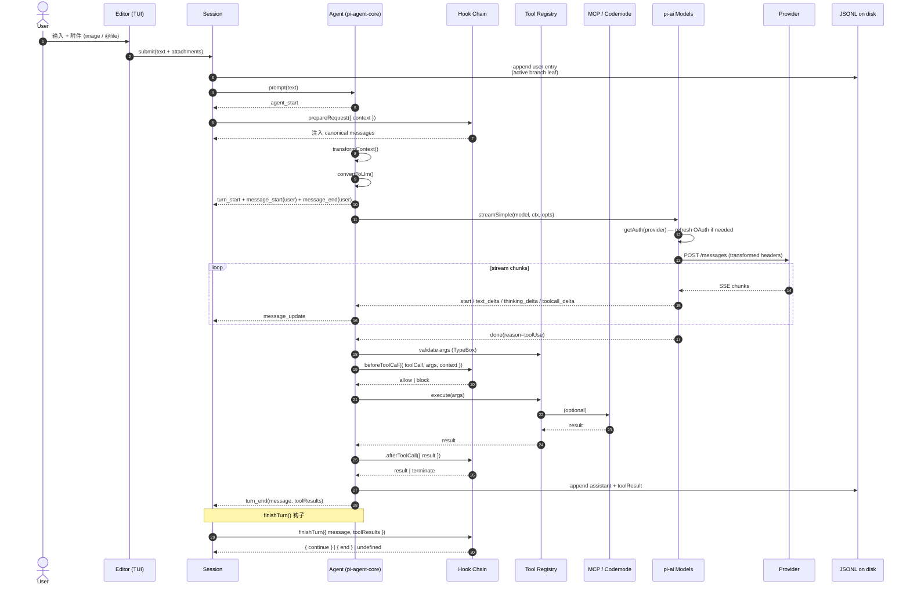

---

## 3. Agent Loop 内部状态机

`agentLoop()` 的核心是下面的状态机。每个状态之间的转换由 LLM 事件、工具结果、队列消息、用户中止共同驱动。

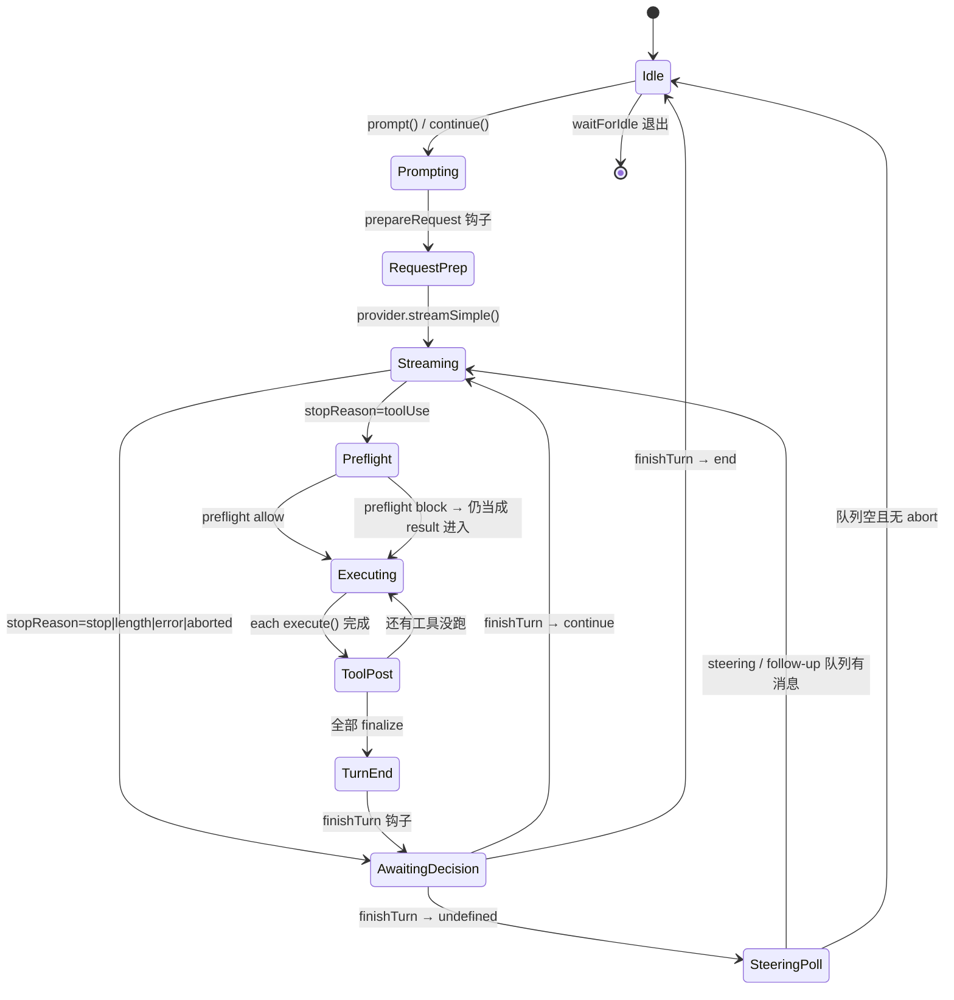

---

## 4. 流式响应的事件序列（pi-ai 视角）

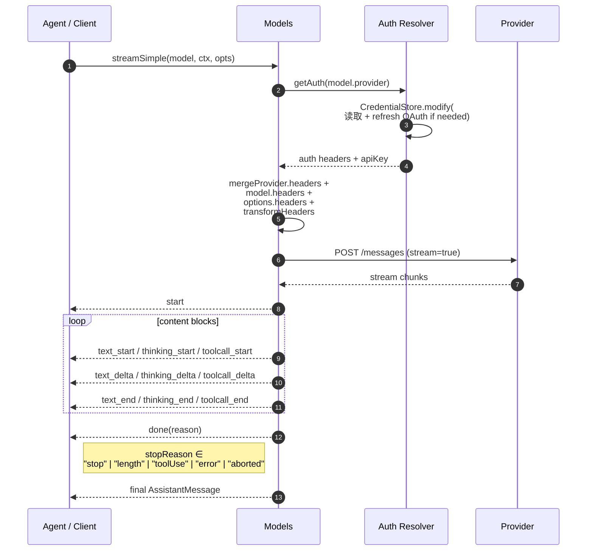

完整事件类型参考：

```text
start                 → 流开始（partial 是初始结构）
text_start            → 文本块开始
text_delta            → 文本 chunk
text_end              → 文本块结束
thinking_start        → 思考块开始
thinking_delta        → 思考 chunk
thinking_end          → 思考块结束
toolcall_start        → 工具调用开始
toolcall_delta        → 工具参数 chunk
toolcall_end          → 工具调用完成
done                  → 流结束，带 reason
error                 → 错误事件，带 reason
```

---

## 5. Tool 执行流程

```mermaid
flowchart TB
    Start([turn 中收到 toolUse]) --> Validate[Step 1: validateToolCall<br/>TypeBox schema 校验]
    Validate -- invalid --> ErrorResult[构造 toolResult<br/>isError=true, 给 LLM 重试]
    Validate -- valid --> Before[Hook: beforeToolCall<br/>{ toolCall, args, context }]
    Before -- block --> BlockResult[返回 block 结果 + terminate?]
    Before -- allow --> Mode{Step 2: 工具执行模式}
    Mode -- sequential --> ExecSeq[按序 execute]
    Mode -- parallel --> Preflight[串行 preflight]
    Preflight --> ExecPar[并行 execute]
    ExecSeq & --> StreamCheck{是否 streaming?}
    StreamCheck -- 是 --> OnUpdate[通过 onUpdate 流式结果]
    StreamCheck -- 否 --> ExecWire[直接结果]
    OnUpdate & --> After[Hook: afterToolCall<br/>{ result, isError }]
    After -- terminate --> FinalResult[Final toolResult + terminate 标记]
    After -- 改写 --> Rewrite[Final toolResult 改写]
    After -- 默认 --> Block
    BlockResult & FinalResult & Rewrite --> ToolMsg[Step 5: 构造 toolResult message]
    ToolMsg --> Persist[Step 6: 持久化到 transcript]
```

---

## 6. Steering / Follow-up 队列行为

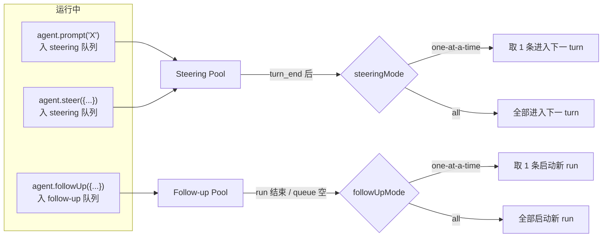

> - **Steering**：当前助手 turn 完成后注入（一次消息，立刻采）
> - **Follow-up**：run 完全结束才进入（一次消息，新 run 开始时采）

---

## 7. 不同运行模式的入口流

### 7.1 Interactive (TUI)

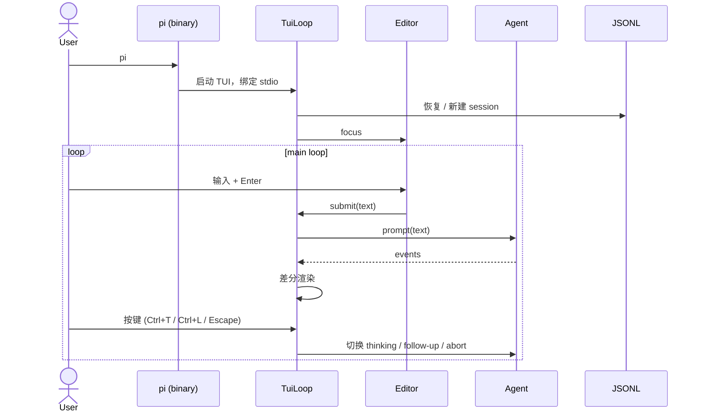

### 7.2 Print Mode (`-p`)

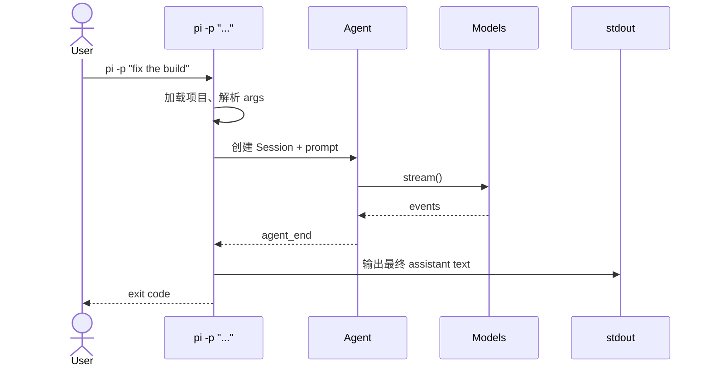

### 7.3 JSON Mode (`--mode json`)

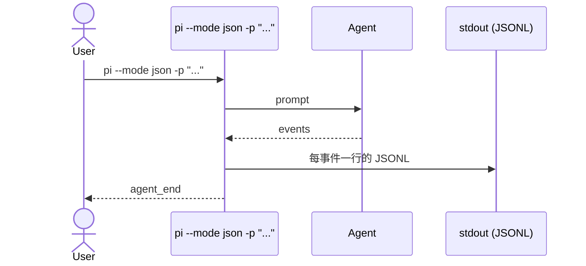

### 7.4 RPC Mode (`--rpc`)

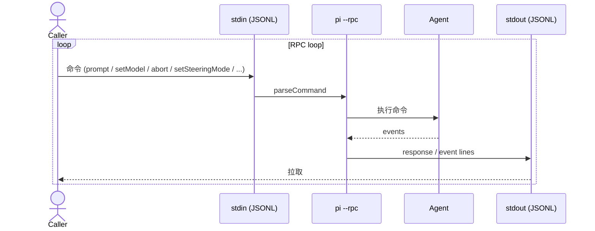

### 7.5 SDK (in-process)

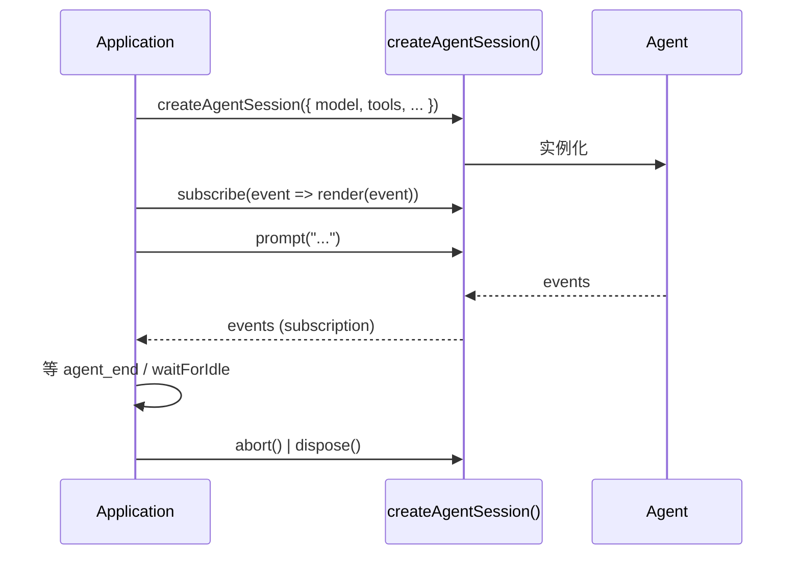

---

## 8. 持久化与会话生命周期

### 8.1 JSONL Session 文件结构

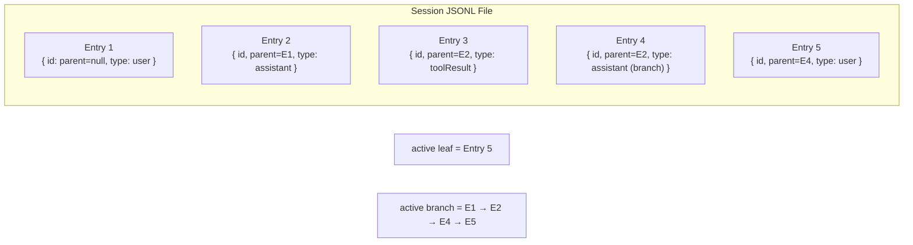

- 每个 entry 有 `parentId`，可建树状分支
- `current` 指向 active leaf，session 上下文 = active branch
- Fork / Clone 复制选定 branch 到新文件

### 8.2 写入流

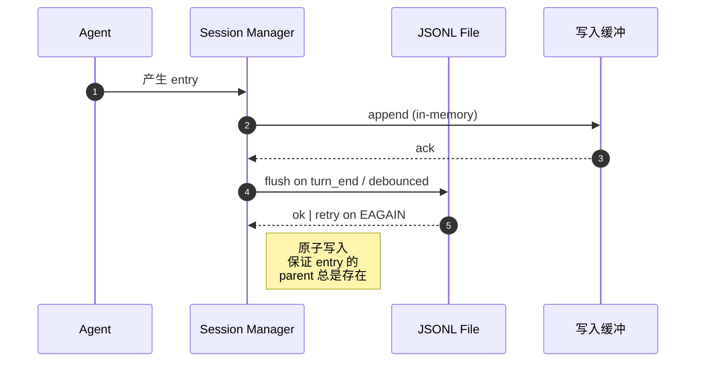

---

## 9. Compaction 流程

当上下文超过 `contextWindow - reserveTokens` 时触发，可手动 `/compact` 或自动。

```mermaid
flowchart TB
    Start([context 超阈值]) --> Type{触发类型}
    Type -- 手动 /compact --> Manual[CompactTask]
    Type -- 自动 / overflow --> Auto[GenerationTask 检测]
    Manual & Auto --> Snap[Step 1: 收集需保留的 entry<br/>新 reset 之后的所有 entry]
    Snap --> Summary[Step 2: 调摘要 LLM<br/>按 keepRecentTokens 截断]
    Summary --> Place[Step 3: 放置 pi.compaction entry<br/>包含 summary + head 引用]
    Place --> Done([下次请求用 pi.compaction 之后的部分])

    Overflow -.->|provider 拒绝后 -->|手动 retry| Manual
    Overflow -.->|一次自动 compact| Auto
```

每次 compact 在与前 reset 之间的「stale」 summary 会 settle 为 `stale`，留下最远的 cut 生效。

---

## 10. Abort 行为流

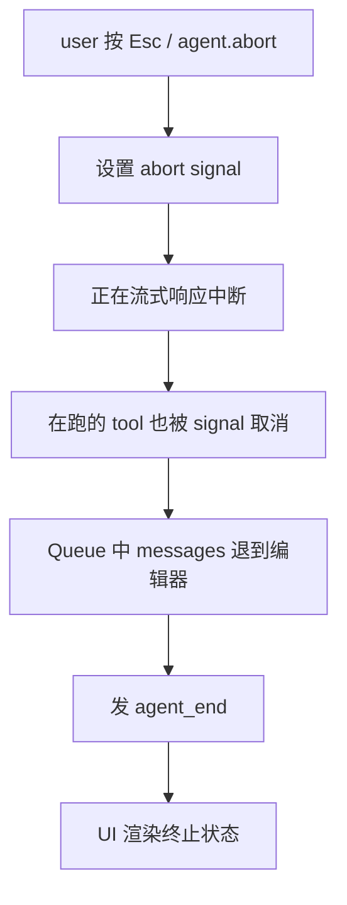

---

## 11. 启动流程（Pi CLI）

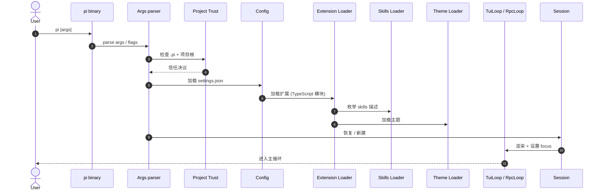

---

## 12. Token 用量与计费累计

```mermaid
flowchart LR
    Stream[Provider stream] --> Usage[AssistantMessage.usage<br/>input/output/cacheRead/cacheWrite]
    Usage --> Accum[Session.usage 累计]
    Accum --> PerModel[per (provider, modelId)]
    Accum --> PerTool[per tool name<br/>(toolResult.reportUsage)]
    Footer[Footer UI] -->|render| PerModel
```

---

## 13. MCP 工具调用流

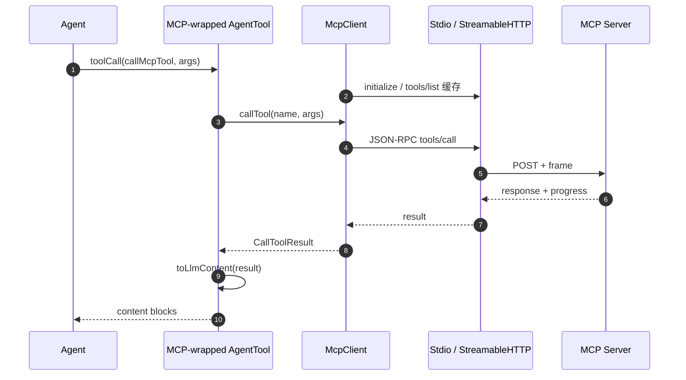

MCP tool result 通过 `toLlmContent` 转为文本 / 图像块；`structuredContent` 透传；`isError: true` 走 LLM 重试。

---

## 14. Codemode 工具调用流

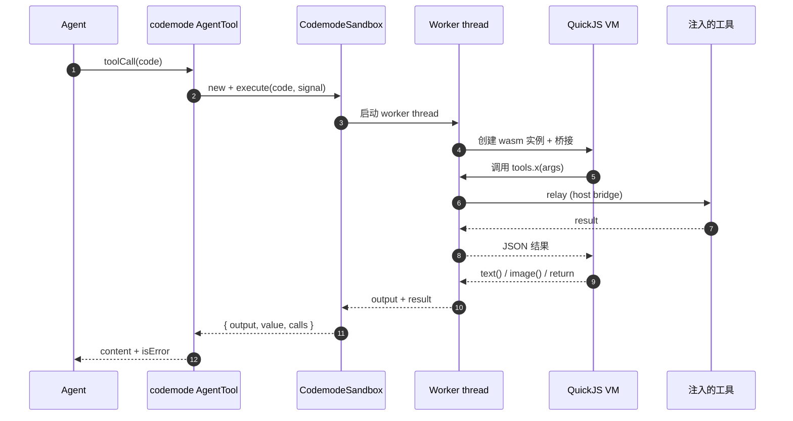

模型代码里的嵌套调用（如 `await tools.read({...})`）**永远不进入 LLM 上下文**；只有最终 `output` / `return` 进。

---

## 15. 与 RPC 模式的协同

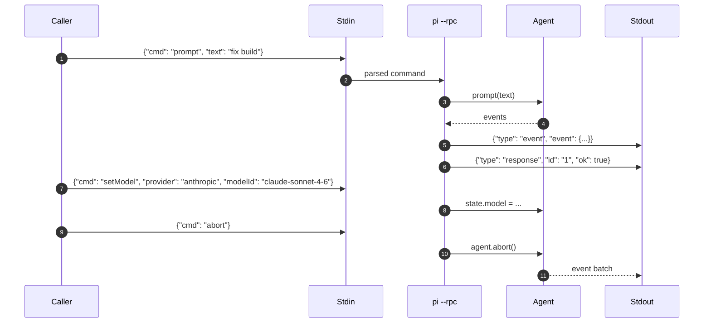

RPC 命令集覆盖：prompt、setModel、setThinkingLevel、abort、setSteeringMode、setFollowUpMode、setTools、订阅事件等。

---

## 16. 异常 / 错误恢复流

```mermaid
flowchart TB
    Event[LLM event / tool error] --> Reason{stopReason}
    Err["error" / "aborted"] --> StreamErr[流式错误 → partial AssistantMessage]
    StreamErr --> Persist[持久化 partial + errorMessage]
    Persist --> Decide{finishTurn?}
    Decide -- continue --> Retry[同上下文再发]
    Decide -- end --> Idle
    Retry --> ApiErr{API 错误?}
    ApiErr -- 401 --> Refresh[OAuth refresh]
    Refresh --> Resume[重发]
    ApiErr -- 429 --> Backoff[指数退避]
    Backoff --> Resume
    ApiErr -- context overflow --> Compact[触发 compaction]
    Compact --> Resume
    ApiErr -- abort --> Idle
```

---

## 17. 子会话与 Background subagent（durable）

```mermaid
sequenceDiagram
    autonumber
    participant User
    participant Root as Root Conversation
    participant Gen as pi.generation
    participant Sub as pi.subagent tool
    participant Child as child conversation
    participant Reporter as reporter (background)

    User->>Root: "实现 X"
    Root->>Gen: turn
    Gen->>Sub: tool call (subagent)
    Sub->>Child: tx.createConversation( ownership: {kind:"task", taskId} )
    Sub->>Child: submit(input)
    Child->>Gen: model run (own cwd / extensions)
    Child-->>Reporter: answer event
    Reporter->>Root: follow-up input (把答案带回)
    Sub-->>Gen: toolResult text
    Gen->>Root: turn_end
    Note over Reporter: background anchor task<br/>survives Root abort
```

---

## 18. 总结

| 阶段 | 关键组件 | 关键产物 |
| --- | --- | --- |
| 启动 | CLI / Tui / 扩展加载 / 信任 | Session + Active branch |
| 输入 | Editor + prompt 模板 + 附件 | User entry |
| 请求 | prepareRequest / transformContext / convertToLlm | LLM Context |
| 调用 | pi-ai / Provider / Auth | Assistant stream |
| 持久化 | Session.append / JSONL | turn 完结 |
| 队列 | Steering / Follow-up | 下一 turn 输入 |
| 终止 | finishTurn / queue empty | agent_end |

**整套机制的同一性**：无论 interactive、RPC、还是 SDK（in-process），都跑同一套 agent loop —— 区别只在「谁在驱动输入流」与「事件流被谁消费」。

下一节 [模块架构图](module-architecture.md) 给出实现这些流程的代码层级与包依赖。